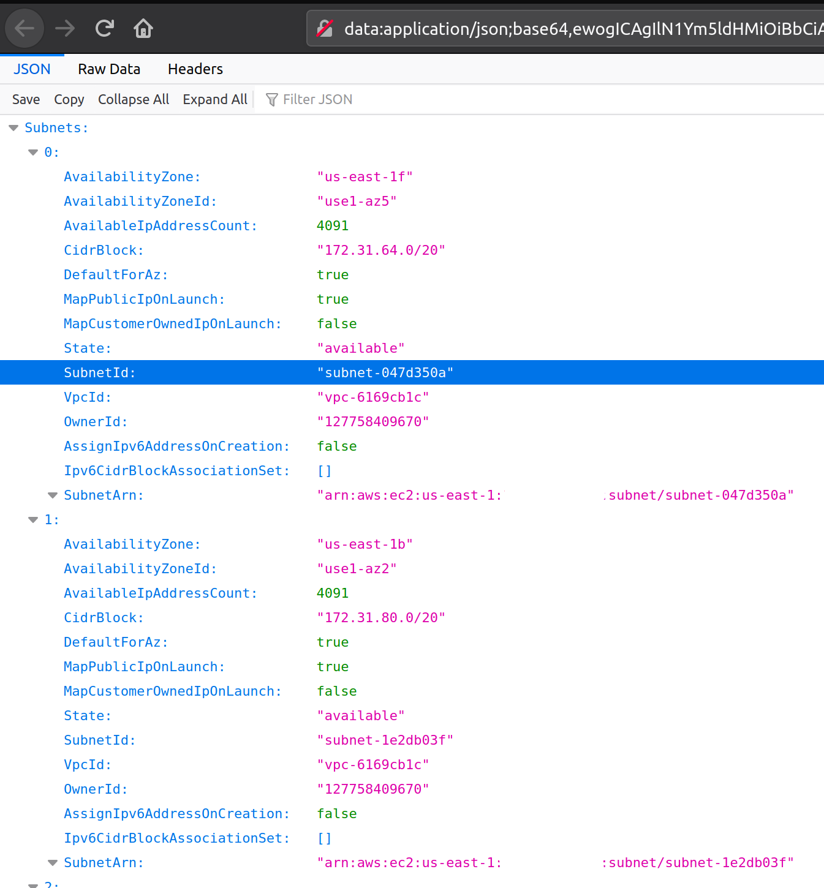

Firefox, supports [Data URIs](https://en.wikipedia.org/wiki/Data_URI_scheme) which allows you to load HTML resource from text in URL as if they were external resources. 

For example, if you enter the below link into your browser, it opens a "Hello world" text document.

```
data:,Hello%2C%20World!
```

This content is not limited to plain text. It can even be an HTML document:

```
data:text/html,%3Ch1%3EHello%2C%20World!%3C%2Fh1%3E
```

<!--more-->

Or any other supported MIME type:

```
data:image/png;base64,iVBORw0KGgoAAAANSUhEUgAAAGQAAABkCAQAAADa613fAAAAIGNIUk0AAHomAACAhAAA+gAAAIDoAAB1MAAA6mAAADqYAAAXcJy6UTwAAAACYktHRAD/h4/MvwAAAAd0SU1FB+UDGxInJl2PylkAAABqdEVYdFJhdyBwcm9maWxlIHR5cGUgYXBwMQAKYXBwMQogICAgICAzNAo0OTQ5MmEwMDA4MDAwMDAwMDEwMDMxMDEwMjAwMDcwMDAwMDAxYTAwMDAwMDAwMDAwMDAwNDc2ZjZmNjc2YzY1MDAwMAqnX4qZAAAC5UlEQVR42u3ZX2iVZRwH8M/Z2dqa0zP/tNxATc2wYDJZDmnOiJoURRBWGiLRfRcVdFURQdFNeBGjLiqoQIhuizBvzCiFWMayJllghK6kUteYW27zdLOoi9jynIf33anf5+pcnOf3/L7nfZ/3fd73EEIIIYQQQgghhBBCCCGEEEKeChnP12i1laZ855e0heszDFHnNg+bdNSwy6mLFzMM8ohnfOBT7TZaYcxobQbp8qL3bXSfBuc1Welnv6Urn92pdbcWPQ56yogy6tRlNve/VucBT1g2xzcK9vvC1rwbnc8Gp5Tt0zBHkJ268m5zfve6pOycvvxaSHOeltRjqZ21HmRi9r6wbc51UgNBRlwEq7XXdpDvnQEt2qqsdJ2OPIP85MhstWrvS2u8anvmO8C/6Teq7IItVdYpGvCjRzXnFeQq+5R9kmCxb3bWJW9am1eUVnvcnKBOkwPKyobsuJJh6TaNk44bSVBnWp9uxwwp+tx0sv4yV7DfQR2yf+hLbLkjHrzyYQtvK73JlMP/hSA7HHI27yaq1+49myoZuNCOyB2+9VXeTVRvibf0VDZ0YR2RO502mHcT1WvzmhsrHbyQjsgeg07UfpDt1nkn+2kbXJt0C7HG63m8ZWn0nLc1Jqu3zCt2ZR+Du4w7aVWiaku97Mlq9+GVrZFtmq23N8kK6/CScQNm8ghSwgm32G1RlTG2eMOvXjCR4CepwLMOWWWJXg/pU6qwSqvHHPe0q/MJAet1zn5a7HaP2+uGOd77/pMl7nfYsN2p/g9IcQkt6XWrJkM+c8r4PN9utFa/XW7yoed9nSZGusfJJpvdo1vBSV/6xogLLpoyo6ygqEGL5dbp0qvbYkcNOJByZaS8qRW02apfj3aMOWfUhGlFzUpWuEYJZ3zkXR8bSzhz4iB/Vmx1vU6dNujQqknRjEnn/WDYoGNOV3upzSbIX+ot0qxR0WW/Gzdeyy93QgghhBBCCCGEEEII/wd/APMIkSFxtxhoAAAAJXRFWHRkYXRlOmNyZWF0ZQAyMDIxLTAzLTI3VDEwOjQwOjA3KzA4OjAwvOJovAAAACV0RVh0ZGF0ZTptb2RpZnkAMjAyMS0wMy0yN1QxMDozOTozOCswODowMGBWmUMAAAAASUVORK5CYII=
```

![smiley](data:image/png;base64,iVBORw0KGgoAAAANSUhEUgAAAGQAAABkCAQAAADa613fAAAAIGNIUk0AAHomAACAhAAA+gAAAIDoAAB1MAAA6mAAADqYAAAXcJy6UTwAAAACYktHRAD/h4/MvwAAAAd0SU1FB+UDGxInJl2PylkAAABqdEVYdFJhdyBwcm9maWxlIHR5cGUgYXBwMQAKYXBwMQogICAgICAzNAo0OTQ5MmEwMDA4MDAwMDAwMDEwMDMxMDEwMjAwMDcwMDAwMDAxYTAwMDAwMDAwMDAwMDAwNDc2ZjZmNjc2YzY1MDAwMAqnX4qZAAAC5UlEQVR42u3ZX2iVZRwH8M/Z2dqa0zP/tNxATc2wYDJZDmnOiJoURRBWGiLRfRcVdFURQdFNeBGjLiqoQIhuizBvzCiFWMayJllghK6kUteYW27zdLOoi9jynIf33anf5+pcnOf3/L7nfZ/3fd73EEIIIYQQQgghhBBCCCGEEEKeChnP12i1laZ855e0heszDFHnNg+bdNSwy6mLFzMM8ohnfOBT7TZaYcxobQbp8qL3bXSfBuc1Welnv6Urn92pdbcWPQ56yogy6tRlNve/VucBT1g2xzcK9vvC1rwbnc8Gp5Tt0zBHkJ268m5zfve6pOycvvxaSHOeltRjqZ21HmRi9r6wbc51UgNBRlwEq7XXdpDvnQEt2qqsdJ2OPIP85MhstWrvS2u8anvmO8C/6Teq7IItVdYpGvCjRzXnFeQq+5R9kmCxb3bWJW9am1eUVnvcnKBOkwPKyobsuJJh6TaNk44bSVBnWp9uxwwp+tx0sv4yV7DfQR2yf+hLbLkjHrzyYQtvK73JlMP/hSA7HHI27yaq1+49myoZuNCOyB2+9VXeTVRvibf0VDZ0YR2RO502mHcT1WvzmhsrHbyQjsgeg07UfpDt1nkn+2kbXJt0C7HG63m8ZWn0nLc1Jqu3zCt2ZR+Du4w7aVWiaku97Mlq9+GVrZFtmq23N8kK6/CScQNm8ghSwgm32G1RlTG2eMOvXjCR4CepwLMOWWWJXg/pU6qwSqvHHPe0q/MJAet1zn5a7HaP2+uGOd77/pMl7nfYsN2p/g9IcQkt6XWrJkM+c8r4PN9utFa/XW7yoed9nSZGusfJJpvdo1vBSV/6xogLLpoyo6ygqEGL5dbp0qvbYkcNOJByZaS8qRW02apfj3aMOWfUhGlFzUpWuEYJZ3zkXR8bSzhz4iB/Vmx1vU6dNujQqknRjEnn/WDYoGNOV3upzSbIX+ot0qxR0WW/Gzdeyy93QgghhBBCCCGEEEII/wd/APMIkSFxtxhoAAAAJXRFWHRkYXRlOmNyZWF0ZQAyMDIxLTAzLTI3VDEwOjQwOjA3KzA4OjAwvOJovAAAACV0RVh0ZGF0ZTptb2RpZnkAMjAyMS0wMy0yN1QxMDozOTozOCswODowMGBWmUMAAAAASUVORK5CYII=
)

Here we are passing in base64-encoded version of the png image. 

If you are on linux, it is easy to generate base64 encoded url:

```
cat smiley.png | base64 | xargs -I % firefox "data:application/png;base64,%"
```

Firefox also ships with an inbuilt JSON viewer. The document rendered should be of MIME type `application/json`. We can use the same trick to pipe any JSON output to firefox:

```
cat person.json | base64 | xargs -I % firefox "data:application/json;base64,%"
```

This is quite handy when trying to navigate long JSON responses from `awscli`. In `awscli` just disable the cli pager and pipe the base64 encoded result firefox.

```
aws ec2-describe-subnets --no-cli-pager | base64 | xargs -I % "data:application/json;base64,%"
```

This gives us a nice visual interface to inspect the json document.




We can even drop it into a handy bash function and pipe json output to this function


```bash
json_viewer(){
    cat /dev/stdin | base64 -w 0 | xargs -I % firefox "data:application/json;base64,%"
}

aws ec2 describe-subnets --no-cli-pager | json_viewer
```


Now when firefox starts [supporting intelligent filtering](https://bugzilla.mozilla.org/show_bug.cgi?id=1244922), using either JMESPath or jq syntax, this can become even more useful. 

